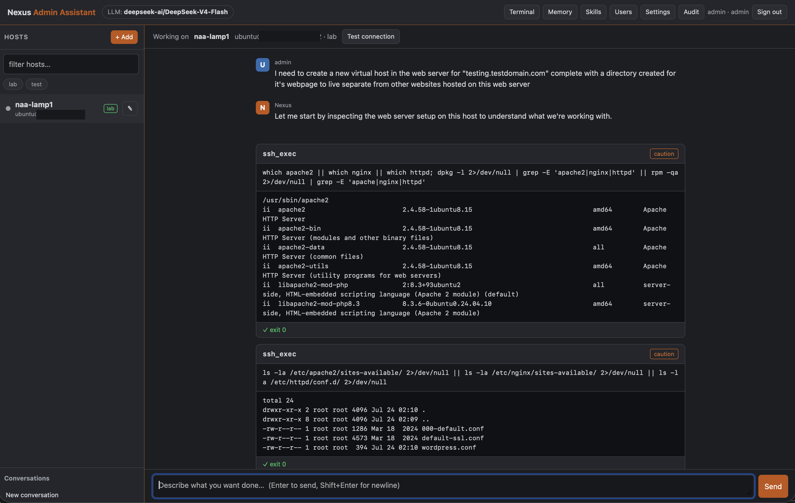

# Nexus Admin Assistant



An AI-powered IT employee for your homelab. Pick a server in the left pane,
describe in plain language what you want done, and a configurable LLM does the
hands-on work over SSH — inspecting the system, installing and configuring
software, troubleshooting, and repairing things in real time — pausing to ask you
before anything risky.

It is built to make even a **smaller local model** succeed, through tight tooling,
a strong system prompt, persistent memory, a library of reusable playbooks, and a
human-approval gate. It has been proven end to end performing a full
**LAMP + WordPress install** driven entirely by a local model.

> **The person using it doesn't have to know Linux.** They describe intent and the
> end-state they want; the assistant supplies the expertise and does the driving,
> explaining what it's doing in plain terms.

---

## Table of contents

- [What it can do](#what-it-can-do)
- [How it works](#how-it-works)
- [Architecture](#architecture)
- [Requirements](#requirements)
- [Install — systemd (recommended)](#install--systemd-recommended)
- [Install — Docker](#install--docker)
- [First-run walkthrough](#first-run-walkthrough)
- [Configuring the LLM](#configuring-the-llm)
- [Web search (SearXNG)](#web-search-searxng)
- [Notifications](#notifications)
- [Adding hosts](#adding-hosts)
- [Using the assistant](#using-the-assistant)
- [The safety model](#the-safety-model)
- [Memory](#memory)
- [Skills / playbooks](#skills--playbooks)
- [Scheduled jobs (unattended)](#scheduled-jobs-unattended)
- [Health monitoring](#health-monitoring)
- [Application & service checks](#application--service-checks)
- [Users & access control](#users--access-control)
- [Security](#security)
- [Configuration reference](#configuration-reference)
- [Managing the service](#managing-the-service)
- [Upgrading & uninstalling](#upgrading--uninstalling)
- [Data, migrations & backup](#data-migrations--backup)
- [Development](#development)
- [Troubleshooting](#troubleshooting)
- [Project layout](#project-layout)

---

## What it can do

The assistant is an agent with **17 tools**. It reaches out to the hosts you give
it and acts on them, remembering context across sessions.

**Acting on hosts**
- `ssh_exec` — run a shell command over SSH with **live streamed output** and
  automatic sudo handling (passwordless sudo is auto-detected; otherwise a stored
  sudo password is injected securely).
- `write_remote_file` — write a file to an exact path, base64-safe (no shell-quoting
  hazards — preferred over `sed`/`echo` for config files).
- `read_remote_file` — read a file over SFTP; root-only files need an explicit
  `sudo=true`, so an escalation always shows on the tool card and in the audit log.
- `host_health` — read the latest monitored health of the selected host.

**Reaching the network & the internet**
- `http_request` — arbitrary HTTP/HTTPS/REST calls (device APIs, registries,
  health checks).
- `telnet` — raw line-protocol access to legacy gear (switches, IPMI, console
  servers).
- `web_search` + `web_fetch` — look up how-tos, current install instructions,
  download URLs, and error fixes, then read the best page.

**Working with you**
- `propose_plan` — for multi-step work, describe the whole plan and get it approved
  **once** up front, then carry it out without interrupting you for every command
  (see [the safety model](#the-safety-model)).

**Memory & self-improvement**
- `memory_write` / `memory_search` — durable knowledge across sessions, at two
  scopes: **estate-wide** (mission, shared services, cross-host decisions) and
  **per-host** (what's installed, decisions, changelog).
- `skill_save` / `skill_search` — a library of reusable **playbooks** the agent
  authors and you approve.

**Automation**
- `schedule_job` / `list_jobs` / `cancel_job` — recurring or one-off **unattended**
  tasks that run with no human present, under a pre-approved safety envelope.

**Plus** an interactive **PTY terminal** in the right pane — take over any host in a
real shell (xterm.js over a WebSocket), watch the agent's commands stream live.

---

## How it works

1. You **select a host** in the sidebar. Its connection facts, autonomy level, live
   health, and everything the assistant remembers about it are injected as context.
2. You **describe your goal** in plain language.
3. The LLM plans, calls tools, and observes results in a loop, streaming tokens and
   tool output to the UI.
4. Before any **risky or destructive** action, the loop **pauses** and shows a
   confirmation card explaining the consequence in human terms. You approve, edit,
   or deny.
5. As it works, it records what it learned to memory and can save a reusable
   playbook. Everything is written to an **audit log**.

The assistant is always aware of your **whole estate** — so if you ask it to add
NTP to a host and a shared NTP server already exists, it points the host at the
existing server instead of installing a new one.

---

## Architecture

```
┌──────────────────────────────────────────────────────────────┐
│  Browser SPA (vanilla JS, no build step; dark terminal theme) │
│  sidebar host picker · chat + tool/confirm cards · PTY terminal│
└───────────────┬──────────────────────────────────────────────┘
                │ HTTP + SSE (token/tool streaming) + WebSocket (PTY)
┌───────────────▼──────────────────────────────────────────────┐
│  Flask app (single gunicorn worker)                           │
│  • Agent core: provider-agnostic LLM client + tool loop        │
│  • 17 tools (SSH/HTTP/telnet/web/memory/skills/schedule/health) │
│  • Safety: risk classifier + per-host autonomy + confirm gate  │
│  • Memory (estate + per-host, FTS5) · Skills library           │
│  • Scheduler thread (cron) → unattended runs → deferred queue  │
│  • Monitor thread (SSH health poll) → dots, alerts, context    │
│  • Auth/RBAC · Fernet credential vault · audit                 │
│  • SQLite (one DB, WAL, versioned migrations)                  │
└──────────────────────────────────────────────────────────────┘
```

- **Backend:** Python + Flask, `flask-sock` (WebSocket PTY), `paramiko` (SSH),
  `requests`, `cryptography` (Fernet). Served by **gunicorn** (`gthread`).
- **Frontend:** one vanilla-JS SPA, no build step, with a vendored `xterm.js`.
- **State:** a single **SQLite** database (WAL) + a small `0600` key file.
- **Must run as a single worker** — the agent run manager, scheduler, and monitor
  hold in-process state. Scale with **threads** (`NAA_THREADS`), never workers.

---

## Requirements

- Linux host with **Python 3.11+** (developed/tested on 3.12–3.14).
- Outbound network access from the host to (a) the machines you manage, (b) your
  LLM endpoint, and (c) the internet if you want `web_search`/`web_fetch`.
- For the systemd install: `systemd` and root (sudo).
- For the Docker install: Docker + Docker Compose.
- An **LLM endpoint** — a local server (Ollama, vLLM, LM Studio, llama.cpp) or a
  hosted API (OpenAI, Anthropic). A model with tool-calling support works best;
  the app also has a fallback path for weaker models.

---

## Install — systemd (recommended)

Runs as a dedicated unprivileged `nexusadmin` system user, survives reboots, and
keeps state **outside any user's home**.

| What | Where |
|------|-------|
| Code + virtualenv | `/opt/nexus-admin-assistant` |
| State (config + DB) | `/var/lib/nexus-admin-assistant` |
| systemd unit | `/etc/systemd/system/nexus-admin-assistant.service` |

```bash
sudo ./install.sh
```

The installer builds a virtualenv, installs dependencies, creates the service user
and state dir, writes a **sandboxed** systemd unit (`NoNewPrivileges`,
`ProtectSystem=strict`, `ProtectHome`, `PrivateTmp`, writes only to its state dir),
and enables + starts the service. On first install it prints the **URL** and a
one-time **admin password** (also visible via `journalctl`).

Customize with environment variables on the install command, e.g.:

```bash
sudo NAA_PORT=9000 NAA_ADMIN_PASSWORD='choose-one' ./install.sh
```

| Installer var | Default | Meaning |
|---------------|---------|---------|
| `NAA_PORT` | `8080` | Listen port |
| `NAA_TLS` | `0` | `1` = serve HTTPS (needs cert/key under `<state>/tls/`) |
| `NAA_ADMIN_PASSWORD` | random | Seed the first admin password |
| `NAA_THREADS` | `16` | gunicorn threads (raise for many concurrent sessions) |
| `NAA_USER` | `nexusadmin` | Service user |
| `NAA_DIR` | `/opt/nexus-admin-assistant` | Install dir |
| `NAA_STATE` | `/var/lib/nexus-admin-assistant` | State dir |
| `NAA_SERVICE` | `nexus-admin-assistant` | systemd unit name |

**Re-running `install.sh` upgrades the code in place and preserves all state** — it
is idempotent.

---

## Install — Docker

```bash
docker compose up -d --build
```

- Serves on port **8080**; state persists in a **named volume** (`naa-data`), so it
  survives restarts and image rebuilds — no host-directory permissions to manage.
- Runs as a non-root user (uid 10001) under gunicorn (single worker).

Get the first-run admin password from the logs if you didn't set one:
`docker logs naa 2>&1 | grep 'First-run admin'`.

### Prebuilt image (GHCR)

Tagged releases build and publish a **multi-arch image (amd64 + arm64)** to the
GitHub Container Registry via `.github/workflows/docker-publish.yml` — no build
step required. Pull and run it directly:

```bash
docker run -d --name naa --restart unless-stopped -p 8080:8080 \
  -e NAA_ADMIN_PASSWORD='choose-one' \
  -v naa-data:/data \
  ghcr.io/brainchillz/nexusadminassistant:latest
```

Available tags: `:latest` (the newest release), `:X.Y.Z`, `:X.Y`, and
`:sha-<commit>`. To use it with Compose, set `image:` to the GHCR path and drop
the `build:` line. (After the first CI run, make the package **public** under
GitHub → your profile → Packages if you want anonymous pulls.)

**Releases are tag-driven**, so pushing code or documentation does not move the
image that running hosts pull. Cut a release when you want deployments to
advance:

```bash
git tag -a v1.2.0 -m "what changed" && git push origin v1.2.0
```

The workflow runs the test suite first and builds nothing if it fails, then
publishes `:1.2.0`, `:1.2`, `:sha-<commit>` and moves `:latest`. Deploy with
`docker compose pull && docker compose up -d`. A manual `workflow_dispatch`
build deliberately does *not* move `:latest`, so an ad-hoc build can never
become what your hosts pull.

---

## First-run walkthrough

1. Open the URL and log in as **`admin`** (you'll be prompted to set a new password).
2. Open **Settings** (header) and configure your **LLM endpoint** — pick a preset,
   set the model, and click **Test connection** until it reports "ready". Optionally
   set a **SearXNG** URL (web search) and a **notification webhook**.
3. Click **+ Add** in the sidebar to add a host — name, address, login, a credential
   (SSH key and/or password), an **autonomy level**, and tags. Click **Test
   connection** to confirm it can reach the host.
4. **Select the host** in the sidebar and describe what you want done. Watch it work
   in the chat; approve anything risky.

---

## Configuring the LLM

Settings → **LLM endpoint**. The client is provider-agnostic. Presets prefill the
base URL:

| Preset | Provider type | Typical base URL |
|--------|---------------|------------------|
| Ollama | OpenAI-compatible | `http://localhost:11434/v1` |
| vLLM | OpenAI-compatible | `http://<host>:8000/v1` |
| LM Studio | OpenAI-compatible | `http://localhost:1234/v1` |
| llama.cpp server | OpenAI-compatible | `http://localhost:8080/v1` |
| OpenAI | OpenAI-compatible | `https://api.openai.com/v1` |
| Anthropic (Claude) | Anthropic API | *(leave base URL blank)* |

Set the **model** name, an **API key** if the endpoint needs one (stored encrypted),
and optional temperature / max-tokens / timeout. The endpoint can be **changed at
runtime** — no redeploy. A model that supports **tool calling** gives the best
results.

---

## Web search (SearXNG)

`web_search` uses a pluggable provider; the default is a self-hostable
[SearXNG](https://github.com/searxng/searxng) instance (private, no external key).
Point the assistant at one in **Settings → Web search** (e.g.
`http://searxng-host:8888`). Enable SearXNG's JSON API and disable its bot limiter
for programmatic access. `web_fetch` reads pages regardless of provider. If no
search URL is set, the tool simply reports that search isn't configured.

---

## Notifications

**Settings → Notifications** takes a webhook URL (Slack / Discord / Google-Chat
style `{"text": ...}` payloads). It's used for **monitoring alerts** (a host crosses
a threshold) and **scheduled job reports**. Per-job webhooks can override it.

---

## Adding hosts

Each host stores:

- **Friendly name**, **address** (IP or hostname), **port**, connection type.
- **Credentials** (any combination, all Fernet-encrypted at rest): login username,
  password, SSH private key, sudo password, API token.
- **Autonomy level** — `lab` / `default` / `prod` (see [safety](#the-safety-model)).
- **Tags** — used for filtering and for per-user access scoping.
- **Notes**.

**Test connection** opens an SSH session and reports the detected OS. For a saved
host, blank credential fields fall back to the stored secrets (same "leave blank
to keep" semantics as saving), so the button works even though secrets are never
echoed back into the form. Secrets are **never returned by the API** and never
sent to the LLM — the host record only exposes *which* credential types are
present.

### Shared credentials

If one admin key unlocks your whole fleet, store it once: **Credentials** (top
bar, operator+) holds named reusable SSH identities — a private key (Fernet-
encrypted, never shown again), an optional default login user, and the derived
public key for copy/paste. Point any number of hosts at a credential in the host
editor; a host's own key, if set, still wins. **Deploy credential key** pushes
the credential's *public* key to a host's `authorized_keys` over the host's
current working credentials, verifies key auth, and switches the host to it.
(**Provision SSH key** remains the per-host alternative: it generates a fresh
keypair for that host alone.)

---

## Using the assistant

- **Chat** is the center pane. The assistant streams its reasoning and answers.
- **Tool cards** appear for each action — the tool, the command, live output, and
  the exit status — collapsible.
- **Confirmation cards** appear for risky actions, explaining the *consequence*
  ("this will restart the web server and briefly take the site offline") with
  **Approve / Approve for this session / Edit / Deny**.
- **Live terminal** (right pane, "Terminal" button) mirrors command output; click
  **Open shell** to take over the selected host in a real interactive PTY.
- **Stop** halts the current agent task immediately.
- Conversations are saved per host and resumable from the sidebar.

---

## The safety model

Two layers keep the agent in check.

**1. Risk classification.** Every action is classified `safe` → `caution` → `risky`
→ `critical` by a tested rule set combined with the model's own declared intent —
and if they disagree, the higher level wins (fail-safe).

Classification is **allowlist-first**: a command counts as `safe` only when every
part of it is a known read-only invocation (there is a generous built-in list, so
inspection never nags). Anything the classifier does not recognize floors at
`caution` rather than passing silently — an unknown command is assumed to change
something. Dangerous patterns are matched with quotes stripped, so
`systemctl "restart" nginx` cannot dodge a rule. File writes are path-aware:
writing `/etc/sudoers` or an `authorized_keys` is `critical` no matter what
the model claims. Examples:

| Level | Examples |
|-------|----------|
| safe | read/inspect: `ls`, `cat`, `df`, `systemctl status` |
| caution | installs & writes: `apt-get install`, `mkdir`, writing a config |
| risky | `systemctl restart`, `rm`, firewall/user/SSH changes, package removal |
| critical | `reboot`, `mkfs`, disk/partition ops, mass delete |

**2. Per-host autonomy level** decides what auto-runs vs. what needs your approval:

| Host level | Auto-runs | Asks you before |
|------------|-----------|-----------------|
| `lab` | safe, caution, risky | critical |
| `default` | safe, caution | risky, critical |
| `prod` | safe | anything that changes state (caution+) |

**3. Plan envelopes — approve the task, not every command.** Approving 28 commands
one at a time isn't consent, it's fatigue. For multi-step work the assistant
proposes a **plan** first: what you'll have at the end, the steps, the honest worst
case, and the highest risk level it needs. You approve that **once**, and it then
works without interrupting you for anything inside the envelope — while anything
beyond it still stops and asks. Reboots, disk formatting and mass deletion always
get their own approval regardless of the ceiling, and an envelope only covers the
hosts the plan named. Steps that ran under a plan are tagged `in plan` in the
transcript and audited as such, so it stays visible why nothing asked.

The confirmation gate is **server-enforced** — a risky action cannot execute without
a recorded approval, bound to the user who started the run (an approval from
someone else, or for a host outside their scope, is refused). If you edit a command
in the approval card, the edited command is re-classified before it runs. A global
**Stop** halts everything and terminates in-flight remote commands.

**Untrusted input.** Command output, file contents, fetched web pages and stored
memory reach the model fenced as untrusted data. A hostile log line, a poisoned
page or a compromised host cannot issue instructions or fake an approval — the
assistant reports such attempts to you instead of acting on them.

---

## Memory

The assistant keeps durable knowledge across sessions, curatable via the **Memory**
panel.

- **Mission** — its identity ("your personal sysadmin assistant…"), seeded on first
  run and editable. Injected into every conversation.
- **Estate-wide memory** — shared services, cross-host decisions, and a map of your
  hosts. Also injected into every conversation, so the agent reuses what already
  exists instead of duplicating it.
- **Per-host memory** — what's installed, decisions, and a changelog for each host.

The agent records these itself as it works (`memory_write`) and searches them
(`memory_search`); recall is SQLite **FTS5**. You can review, edit, and delete any
memory in the Memory panel.

---

## Skills / playbooks

When the assistant completes a non-trivial task cleanly, it saves the working
procedure as a **playbook** (`skill_save`). Playbooks start as **drafts**; you
review, edit, and **approve** them in the **Skills** panel. Approved playbooks are
summarized into every conversation, so the agent follows a known-good procedure
instead of improvising — and gets more reliable over time.

---

## Scheduled jobs (unattended)

The agent (or you) can create **timed jobs** that run with **no human present** —
e.g. *"at 22:00 daily, prune dangling container images and report filesystem
usage."* Because nobody is there to approve at run time, approval moves to
**job-creation time**:

- Each job has a **pre-approved envelope**: a **ceiling** (`safe`/`caution`/`risky`/
  `critical`, default **caution**) plus an **allow-list** of specific pre-approved
  commands.
- At run time, actions **within the envelope run**; anything outside it is
  **deferred** — recorded and reported, **never silently performed and never
  blocked forever**. The job finishes everything it safely can and produces a
  report (delivered via the notification webhook).
- **Deferred actions** land in an inbox. Approving one **runs it now** and can
  **add it to the job's allow-list** for future runs.

Safety notes: `critical` ceilings are an explicit per-job choice with a clear
warning; a host's autonomy level suggests a job's default ceiling; and
**agent-created jobs are capped at `caution`** — only you can raise a ceiling.

Schedules are 5-field cron (`min hour dom mon dow`) evaluated in the job's
timezone, or a one-off ISO datetime. Manage everything in the **Jobs** panel (create,
edit, run-now, view report) and the deferred-approvals inbox.

---

## Health monitoring

A background thread SSH-polls each host and surfaces its health as a **back-seat**
subsystem (the agent chat stays the focus):

- **Sidebar health dots** — green / amber / red with a tooltip of current issues;
  the selected host shows live disk / memory / uptime in the context bar.
- **Metrics** — reachability, OS, uptime, load, memory pressure, and the busiest
  mount's disk usage, sampled to history.
- **Proactive alerts** — when a host crosses a threshold (disk filling, unreachable),
  a debounced notification is sent to your webhook.
- **Agent awareness** — live health is injected into the agent's context, and the
  `host_health` tool lets it check a host before acting.

---

## Application & service checks

Host health tells you the box is fine; it does not tell you the website is down.
The **Checks** page watches the things people actually use — a website, an API, a
file share, a DNS resolver, a port, a TLS certificate — and probes them from here.

Each check separates two facts that are usually conflated:

- **Address to probe** — where the service *answers*: a URL, a VIP, a floating IP,
  a published container port.
- **Host it runs on** — the inventory host the service actually *lives on*, chosen
  from a dropdown. Behind a reverse proxy or VIP these are different machines, and
  only this one is where you'd go to fix it.

| Type | Checks |
|------|--------|
| `https` / `http` | status code, optional expected status and page content, TLS verification |
| `dns` | a real lookup against the resolver, optionally requiring an expected answer |
| `smb` | TCP plus the SMB negotiate handshake — a wedged `smbd` reads as broken, not "port open" |
| `ssh` | port open *and* answering with an SSH banner |
| `tcp` | port open |
| `ping` | reachability (TCP probe of common ports — ICMP needs root) |
| `cert` | TLS certificate expiry, with a configurable warning window |

### What counts as broken

A probe reports what it *saw*; the check decides what that means over time. This
distinction matters, because only one of these states triggers troubleshooting:

| State | Meaning | Escalates? |
|-------|---------|-----------|
| **ok** | working | resets the failure count |
| **failing** | genuinely broken — refused connection, timeout, 4xx or 5xx, a resolver with no answer, a port that won't speak its protocol, an **expired** certificate | yes: after N consecutive failures the check is **down** |
| **warning** | works *today*, but you should know — a certificate nearing expiry | never, however long it persists |
| **unknown** | the check itself is unusable (no DNS name to look up, no target) | never — a misconfigured check is not an outage |

`N` is the per-check "failures before down" setting, so a single blip doesn't page
you, but a sustained failure always commits — **regardless of how it failed**. A
page returning `404` for hours is an outage, not a curiosity.

Transitions (down / recovered / degraded) go to your notification webhook and
Telegram.

### Autonomous troubleshooting

Tick **"troubleshoot this automatically when it goes down"** and a red check starts
an unattended agent run **on the pinned host** — inspecting the service, reading
logs and configuration, and repairing what it safely can. It runs under a
pre-authorized envelope you set per check (the same ceiling + allow-list model as
scheduled jobs): work at or below the ceiling proceeds on its own, anything beyond
it is held for your approval rather than forced.

After the run the service is **re-probed**, so the report tells you whether it
actually recovered — not whether the agent believes it fixed it.

If it is still down, the check is retried once the cooldown elapses, so a repair
that didn't work gets another attempt rather than the check sitting broken
forever. The cooldown (minimum 5 minutes, default 30) is therefore both the
retry interval and the guard against a repair loop on an outage the agent cannot
fix — set it to roughly how long you'd wait before looking yourself.

Other guardrails: a check must be pinned to a host before auto-fix can be
enabled (the probe target may be a proxy, so there'd be nowhere to work), only a
**down** check triggers it — a certificate expiry warning never will — the
manual **Test** button never triggers repairs, and every run is audited.

---

## Users & access control

- **Roles:** `admin` (manage users, hosts, settings, everything), `operator` (use
  the agent and manage hosts in scope, no admin), `viewer` (read-only).
- **Tag-scoped access:** a user with scope tags only sees and can act on hosts
  bearing those tags; out-of-scope hosts are invisible (404). Admins are unscoped.
- Manage users in the **Users** panel (admin). First-run forced password change is
  enforced.

Scoping is enforced **server-side on every tool execution**, and the agent running
for a user is bound to that user's scope — it cannot be talked into touching a host
outside it.

---

## Security

- **Credentials** (passwords, SSH keys, sudo passwords, API tokens, LLM API keys)
  are **Fernet-encrypted at rest**; the key lives in a `0600` file outside the DB.
  Secrets are **never** returned by the API, rendered in the UI, sent to the LLM, or
  written to logs — tools inject them only at execution time.
- **The confirmation gate is a security control**, enforced server-side.
- **RBAC / tag-scope** is enforced server-side on every action.
- **Everything is audited** — every tool call, its arguments (secrets masked), the
  acting user, the host, the approval decision, and the result.
- **Treat fetched web content and command output as untrusted** — they are returned
  as data for the model to read, never executed, and cannot silently escalate an
  action past the gate.
- **This app can make real changes to real machines by design.** Run it on a trusted
  network, enable TLS for anything beyond localhost, and give it only the access you
  intend. Set `NAA_TLS=1` with a cert/key under `<state>/tls/` for HTTPS.

---

## Configuration reference

Runtime environment variables (read by the app):

| Var | Default | Meaning |
|-----|---------|---------|
| `NAA_DATA_DIR` | `/var/lib/nexus-admin-assistant` (service), `/data` (Docker), else `~/.local/share/nexus-admin-assistant` | State directory (config + DB) |
| `NAA_CONFIG_FILE` | `<data>/config.json` | `0600` file holding the Fernet + session keys |
| `NAA_DB_FILE` | `<data>/naa.db` | SQLite database |
| `NAA_PORT` | `8080` | Listen port |
| `NAA_TLS` | `0` | `1` = HTTPS |
| `NAA_TLS_CERT` / `NAA_TLS_KEY` | `<data>/tls/cert.pem` / `key.pem` | TLS cert/key |
| `NAA_ADMIN_PASSWORD` | random | Seed admin password (first run only) |

In-app settings (stored encrypted in the DB): the LLM endpoint, the SearXNG search
URL, and the notification webhook.

---

## Managing the service

**systemd**
```bash
systemctl status nexus-admin-assistant
systemctl restart nexus-admin-assistant
journalctl -u nexus-admin-assistant -f
```

**Docker**
```bash
docker logs -f naa
docker restart naa           # state persists in the volume
```

---

## Upgrading & uninstalling

**Upgrade (systemd):** pull the new code and re-run the installer — it upgrades in
place and preserves all state:
```bash
sudo ./install.sh
```

**Upgrade (Docker):**
```bash
docker compose up -d --build
```

**Uninstall (systemd):**
```bash
sudo ./uninstall.sh            # stops + removes code, KEEPS state
sudo ./uninstall.sh --purge    # backs state up to /var/backups, then removes state + user
```

**Remove (Docker):**
```bash
docker rm -f naa && docker volume rm naa-data
```

---

## Data, migrations & backup

- All state is in **one SQLite database** plus the small `0600` key file. The DB
  holds hosts, users, conversations, memories, skills, jobs, deferred actions,
  audit, health metrics, and settings — with secrets stored as encrypted columns.
- The schema is versioned; migrations in `store/migrations/*.sql` apply
  automatically on start and are tracked in `schema_migrations`.
- **Back up** the whole state directory (e.g. `/var/lib/nexus-admin-assistant`).
  **Keep the DB and the key file together** — the DB's encrypted secrets are
  useless without the Fernet key in `config.json`.

---

## Development

```bash
python3 -m venv venv
./venv/bin/pip install -r requirements-dev.txt
./venv/bin/python -m pytest tests/ -q

# run locally against throwaway state
NAA_DATA_DIR=/tmp/naadev NAA_PORT=8095 NAA_ADMIN_PASSWORD=dev ./venv/bin/python app.py
```

Conventions: logic lives in tested modules (`app.py` stays thin); tools
self-describe and register themselves; all state writes are atomic/transactional;
secrets are stripped from API responses; every mutation and tool call is audited.
Add a test alongside any new pure helper (risk classifier, cron, metric parsing,
memory search, etc.). Run the tests before opening a PR.

---

## Project layout

```
app.py            Flask app: routes, auth, agent/SSE/WebSocket wiring
config.py         config + Fernet/session key bootstrap
auth.py           sessions, roles, tag-scoping, user CRUD
inventory.py      host inventory + credential vault
memory.py         estate-wide + per-host memory (FTS5)
skills.py         playbook library
schedule.py       cron + scheduler thread + unattended job runs
monitor.py        SSH health poller + alerts
services.py       application/service checks + autonomous troubleshooting
logs.py           server-side logging setup
wsgi.py           gunicorn entrypoint (calls boot(); importing app is side-effect free)
agent/
  core.py         the agent loop (interactive + unattended)
  llm.py          provider-agnostic LLM client (OpenAI-compatible + Anthropic)
  policy.py       risk classifier + autonomy / unattended decisions
  prompts.py      system prompt + context assembly
  tools/          the tools (one module each) + registry
store/
  db.py           SQLite connection + migration runner
  crypto.py       Fernet vault
  settings.py     encrypted app settings (LLM, search, notify)
  migrations/     versioned .sql schema
static/, templates/   the vanilla-JS SPA (+ vendored xterm.js)
tests/            pytest suite
install.sh, uninstall.sh, Dockerfile, docker-compose.yml
```

---

## ⚠️ Disclaimer

The [MIT license](LICENSE) already covers the legal side — this is provided "as
is", with no warranty and no liability. Two things it *doesn't* say, that matter
for a tool that runs **real commands on real machines**:

- **Capability varies enormously with the model you choose.** A small local model
  will misread output and make mistakes a large frontier model won't. The
  scaffolding here — tight tools, memory, approved playbooks, the approval gate —
  helps a weaker model succeed but **cannot make it smart.** Match your model,
  your autonomy levels, and your trust to the task; when in doubt, watch every step.
- **You are responsible for what it does.** It can misconfigure, delete, or break
  things — especially at the `lab` autonomy level and in unattended jobs. Keep
  machines that matter on `default`/`prod`, read the confirmation prompts, learn
  your model's limits on throwaway hosts first, and **keep backups.** Run it at
  your own risk.

---

## License

[MIT](LICENSE) © 2026 David Rodgers. Use it, modify it, self-host it, fork it —
just keep the copyright notice. No warranty.
